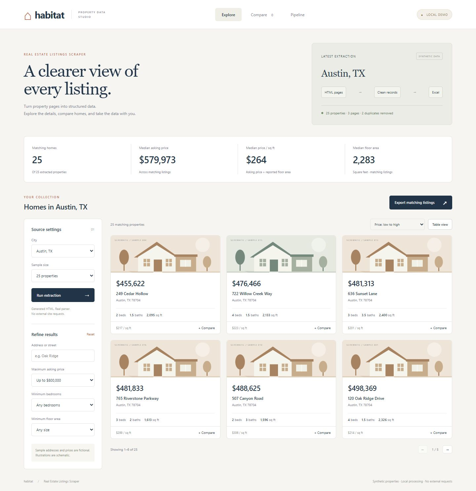
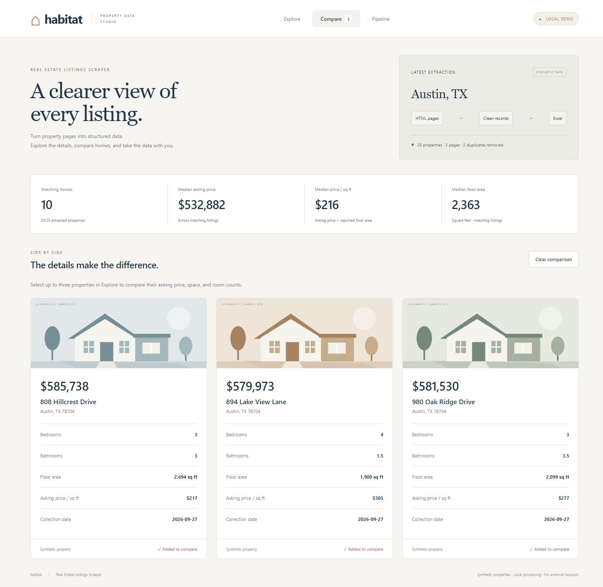

# Habitat · Real Estate Listings Scraper

A Python project that extracts paginated property listings, normalizes their details, and exports a usable Excel workbook. **Habitat** is its local demonstration dashboard: filter properties, compare up to three homes, inspect processing activity, and export the matching records.

**Python 3.11+ · Playwright / Chromium · BeautifulSoup · pandas · openpyxl · HTML / CSS / JavaScript**



## Launch the dashboard

```bash
python -m venv .venv
# Windows:
.venv\Scripts\activate
# macOS / Linux:
# source .venv/bin/activate
python -m pip install -r requirements.txt
python realestate_scraper.py --serve
```

Open **http://127.0.0.1:8766**. On Windows, **Start-Demo.cmd** creates the environment, installs dependencies, and starts the dashboard. Python 3.11+ must be installed; the launcher can also find the existing bundled Python runtime in a Codex desktop installation.

The server binds only to the local machine. Stop it with Ctrl+C. Use `--serve --port 8767` if the default port is busy. This standard-library HTTP server is for local demonstrations, not public hosting.

Installing dependencies needs network access. The dashboard itself makes only local requests and uses generated HTML; it does not require a browser-binary download.

## A demo that exercises the extraction code

The offline flow creates property-card HTML with repeated listings at page boundaries, then runs it through the same card parser, filter checks, deduplication, and pagination collector used by the browser scraper.

```bash
# Parse local HTML and export 25 records
python realestate_scraper.py --demo --output exports/listings_demo.xlsx

# Also test JavaScript rendering in a real Chromium instance
python -m playwright install chromium --only-shell
python realestate_scraper.py --demo-browser --output exports/browser_demo.xlsx
```

The Chromium demo inserts the fixture cards asynchronously with JavaScript. Playwright waits for the rendered selectors before extraction, and page network requests are blocked. **This path was run successfully during the review**, and its records were checked against the ordinary HTML-fixture path.

The dashboard starts with **25 properties across 3 pages**, removing **2 repeated listings**. Its source pool uses a maximum asking price of $800,000 and at least 2 bedrooms; the sidebar then filters that fixed pool. The terminal demo keeps the original defaults of $500,000 and at least 3 bedrooms, so its sample workbook is a different synthetic dataset.

All addresses and prices are fictional. Listing URLs use the reserved `homes.example` domain. The house illustrations are labeled schematics, not property photographs. The default seed is 42; collection dates use the current date. Synthetic data supports a software demonstration and is not evidence about an actual housing market.

## Explore, compare, export

- Search by address or street; filter by maximum price, bedrooms, and minimum floor area.
- Sort by price in either direction or by largest floor area.
- Switch between property cards and a compact table; paginate without changing the filters.
- Select up to three properties for side-by-side comparison, including asking price per square foot.
- Inspect each page's parsed and retained record counts in the Pipeline view.
- Export all matching properties in the current sort order, including rows beyond the visible page.

The four headline metrics describe **all matching records**, not just the visible page or selected comparison. Median price per square foot is the median of individual asking-price / reported-area ratios. Unknown values remain unavailable rather than becoming zero.



## Engineering details

| Area | Implementation |
|---|---|
| Dynamic content | Playwright waits for listing or explicit empty-results selectors instead of relying on an arbitrary render sleep |
| Parsing | Independent fallbacks for beds, baths, and floor area; missing links and detached elements do not erase otherwise valid fields |
| URL handling | Proper relative/protocol-relative resolution; safe schemes; tracking cleanup; normalized city separators |
| Data quality | Numeric filter checks, exact property deduplication, and missing/ambiguous values kept distinct from zero |
| Pagination | Next-link traversal, repeated-URL detection, same-host restriction, and a hard page cap |
| Failure reporting | Blocked/unknown pages are failures; partial results retain their warning and return a nonzero exit code |
| Resource handling | Browser closure in `finally`; 30-second navigation and 15-second selector timeouts |
| Workbook output | Typed prices/room counts/area/dates, numeric formats, filters, frozen headers, and source notes |
| Export integrity | Formula-like text stays literal; invalid Excel control characters are removed; atomic file replacement preserves previous output on failed writes |
| Reproducibility | Seeded local random generator, saved test fixtures, stubbed browser failures, and an optional real Chromium integration test |

The selectors target Realtor.com-style cards. The parser is not a universal adapter for every portal. The `Listing` model and Excel exporter can be reused with other sources. Deduplication uses the normalized listing URL when present, otherwise the normalized address; it retains the first record for that identity.

## CLI options

| Option | Default | Meaning |
|---|---|---|
| `--serve` | off | Start the offline dashboard |
| `--port` | 8766 | Dashboard port |
| `--demo` | off | Run generated HTML through the parser |
| `--demo-browser` | off | Render local JavaScript fixtures in Chromium |
| `--city` | Austin, TX | Search or demo location |
| `--max-price` | 500000 | Maximum asking price; positive integer |
| `--min-beds` | 3 | Minimum bedrooms; nonnegative integer |
| `--max-pages` | 3 | Live pagination limit; positive integer |
| `--count` | 25 | Demo size, 1–500 |
| `--seed` | 42 | Demo seed |
| `--output` | listings.xlsx / listings_demo.xlsx | Excel destination; missing parent folders are created |
| `--no-headless` | off | Show the live browser |

`--serve`, `--demo`, and `--demo-browser` are mutually exclusive. Dashboard source controls support Austin, Denver, and Raleigh with 25, 50, or 100 properties. The CLI accepts other cities; unrecognized demo cities omit ZIP codes. Dashboard configuration comes from its controls rather than the CLI search flags.

Exit codes: **0** success; **1** operational failure or no matching results; **2** argument errors or a marked partial export; **130** interruption. A user-selected page cap bounds the run and does not imply complete coverage of a directory. Logging goes to the console; importing the module does not create a log file.

## Live mode

```bash
python -m playwright install chromium
python realestate_scraper.py --city "Austin, TX" --max-price 500000 --min-beds 3 --max-pages 3
```

Use a source only when its terms and your permissions allow the intended access. The program stops on HTTP failures or unrecognized page layouts and does not solve access challenges. It keeps randomized 4–8 second delays between live pages.

**Current Realtor.com access and selector compatibility were not verified.** The successful Chromium check used local synthetic pages. Production reliability, real market coverage, and listing-data licensing are outside this demonstration's verified scope.

## Development and checks

```bash
python -m pip install -r requirements-dev.txt
python -m pytest -q
python -m ruff check .
```

The standard suite runs without a Chromium binary. Enable the additional browser integration test after installing it:

```powershell
# PowerShell
$env:RUN_BROWSER_TESTS = "1"
python -m pytest -q
```

```bash
# macOS / Linux
RUN_BROWSER_TESTS=1 python -m pytest -q
```

The reviewed build passed **82 tests including the real Chromium test** on Windows / Python 3.12. The standard run skips that one optional test. CI is configured for Python 3.11 and 3.12; remote CI was not run during this review.

The browser walkthrough covered combined filters, empty states, sorting, pagination, card/table views, comparison limits, source changes, and desktop/mobile layouts. Workbook responses were checked in automated tests. The browser download permission was declined, so that UI download step remains unverified.

## Portfolio materials

- [Project summary, LinkedIn draft, and interview walkthrough](PORTFOLIO.md)
- [Debugging evidence and verification limits](REVIEW.md)
- [Filtered table screenshot](docs/screenshots/02-filtered-table.jpg)
- [Extraction pipeline screenshot](docs/screenshots/04-extraction-pipeline.jpg)
- [Sample workbook from the local Chromium demonstration](sample_listings.xlsx)

## License

MIT — see [LICENSE](LICENSE).
